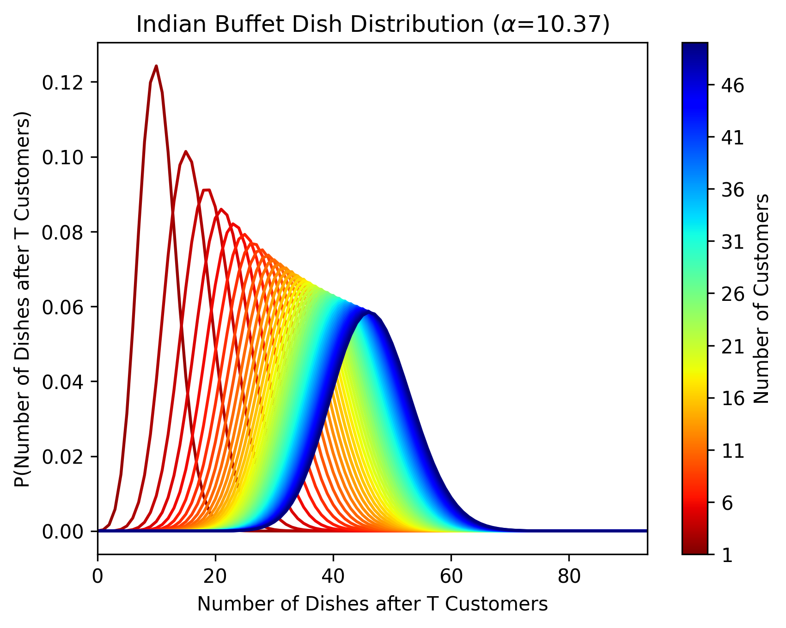

# Efficient Online Inference for Infinite Latent Feature Models

This code corresponds to the [NeurIPS 2021](https://nips.cc/Conferences/2021/Dates)
paper.

## Setup

After cloning the repository, create a virtual environment for Python 3:

`python3 -m venv ribp`

Then activate the virtual environment:

`source ribp/bin/activate`

Ensure pip is up to date:

`pip install --upgrade pip`

Then install the required packages:

`pip install -r requirements.txt`

We did not test Python2, but Python2 may work.

## Running

Each experiment has its own directory, each containing a `main.py` that creates a `plots`
subdirectory (e.g. `exp_00_ibp_prior/plots`) and then reproduces the plots in the paper. Each 
`main.py` should be run from the repository directory e.g.:

`python3 exp_00_ibp_prior/main.py`

## TODO

- Implement IBP baselines
  - One of Paisley & Carin's papers
  - Particle Filtering

- Derive Factor Analysis and Non-negative Matrix Factorization
- Implement Factor Analysis and Non-negative Matrix Factorization
- Implement Omniglot
- Plot comparison of ground-truth features and inferred features
- Plot comparison of ground-truth indicators and inferred indicators
- Implement MNIST comparison of classes based on inferred features
  - PCA MNist

## Contact

Questions? Comments? Interested in collaborating? Open an issue or 
email Rylan Schaeffer at rylanschaeffer@gmail.com and cc Ila Fiete at fiete@mit.edu.
